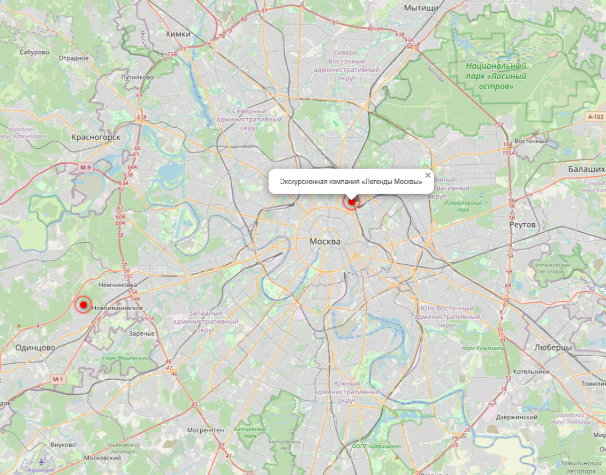

## My new app "Where to go" as part of the Django ORM course.
#### "Where to go" 
This is project where you could found intresting place, to go. For example, interesting architectural monuments, natural parks and excursions. You can see photos and short descriptions of these places.

#### To clone repo:
```
git clone https://github.com/DmitryShvedov88/Poster-on-the-map.git
```

#### Environment variables:
You should have:
1. SECRET_KEY - it's Django security key/ 
2. DEBUG - True/False, debug mode
3. ALLOWED_HOSTS - List of hosts that will serve the site

#### How to install requirements
1. Python 3.10 should already be installed.  
2. Use pip (or pip3, if there is a conflict with Python2) to install dependencies. 
  
```
pip install -r requirements.txt
```

#### Make migrations

```
python manage.py migrate
```

#### How to start:

```
python manage.py runserver
```

#### Crate superuser

```
python manage.py createsuperuser
```

Now you can add some places in admine pannel.
Go to http://127.0.0.1:8000/admine
You have several tabs where you can add coordinates, photos, description of an interesting place.

After all you can go to http://127.0.0.1:8000/
And find your places.

#### How to add place

```
python manage.py load_place --json_url "your_url".json
```

You can add place, photos, match faster using JSON/

#### Json example

https://github.com/devmanorg/where-to-go-places/blob/master/places/Экскурсионный%20проект%20«Крыши24.рф».json


```
{
    "title": "Экскурсионный проект «Крыши24.рф»",
    "imgs": [
        "https://raw.githubusercontent.com/devmanorg/where-to-go-places/master/media/af7b8599fec9d2542a011f1d01d459e2.jpg",
        "https://raw.githubusercontent.com/devmanorg/where-to-go-places/master/media/965c5a3ff5b2431e646d30b6744afd2d.jpg",
        "https://raw.githubusercontent.com/devmanorg/where-to-go-places/master/media/06868b2b01ff8db506cd21956a6cb636.jpg",
        "https://raw.githubusercontent.com/devmanorg/where-to-go-places/master/media/a8cc3e03f56413275ded99e51226a70f.jpg",
        "https://raw.githubusercontent.com/devmanorg/where-to-go-places/master/media/44e96733303e7490aaa1cf2eebfbbfff.jpg",
        "https://raw.githubusercontent.com/devmanorg/where-to-go-places/master/media/fadf618505b087fa539e883f33f850b2.jpg",
        "https://raw.githubusercontent.com/devmanorg/where-to-go-places/master/media/ec461a89a1d0d5a4cb7c81f1fc0a4e89.jpg"
    ],
    "description_short": "Хотите увидеть Москву с высоты и разделить яркие впечатления с друзьями? В этом поможет проект «Крыши24.рф». Вы можете выбрать крышу из множества интересных вариантов и провести там свидание, вечеринку, творческое занятие, фотосессию или что-то ещё.",
    "description_long": "<p>Проект «Крыши24.рф» проводит экскурсии и мероприятия на крышах, откуда открываются впечатляющие виды на мегаполис. </p><h4>Экскурсии на высоте</h4><p>Список крыш, на которые можно подняться, очень велик, и находятся они в разных уголках города. Оттуда видны достопримечательности и красивейшие городские панорамы, так что это отличная возможность заново открыть для себя Москву. Экскурсии безопасны, на эти крыши можно подниматься с детьми. Перед подъёмом опытный гид проведёт инструктаж и будет сопровождать вас во время прогулки.</p><p>С крыш, доступных для посещения, вы увидите «Москва Сити» вблизи, стадион «Лужники», Новодевичий монастырь, Красную и Киевскую площади, мост Богдана Хмельницкого, сталинские высотки, Новый Арбат, и многие другие знаковые места столицы. </p><p>Стоимость экскурсии — 1250 рублей, продолжительность — 1 час. В стоимость экскурсии включены услуги гида.</p><h4>Свидания на высоте птичьего полёта</h4><p>А ещё «Крыши24.рф» — настоящая находка для тех, кто хочет устроить незабываемое романтическое свидание. Выбирайте свой вариант из пяти крыш, расположенных рядом с главными достопримечательностями, и удивите любимого человека. </p><p>На крыше для вас устроят зону отдыха с пледами и подушками. В стоимость также входят свечи, цветок, бокалы, столовые приборы, фруктовая тарелка и напиток. А если ваше событие более строгое и торжественное, то для вас поставят праздничный стол и стулья. За дополнительную плату вы можете заказать букет цветов, воздушные шары, музыканта, виниловый проигрыватель, салют, напитки и еду. </p><p>Базовая стоимость свидания — 5500 рублей, продолжительность — 2 часа.</p><p><strong>Фотосессии над Москвой</strong></p><p>Необычным подарком для себя и для любимых может стать фотосессия на крышах. Из полусотни вариантов крыш вам помогут выбрать ту, которая подойдёт именно вам. На сессии будет работать профессиональный руфер-фотограф с опытом более 10 лет. В итоге вы получите около 100 фотоснимков, 15 из них — уже обработанными, так что их можно будет сразу выкладывать в соцсети и удивлять друзей.</p><p>Стоимость фотосессии — от 4000 рублей, продолжительность — 1 час. </p><p>Также проект «Крыши24.рф» организует девичники, вечеринки, творческие мероприятия и многое другое.</p><p>Узнать подробности можно на <a class=\"external-link\" href=\"https://www.крыши24.рф/\" target=\"_blank\">официальном сайте</a> и в <a class=\"external-link\" href=\"https://instagram.com/roof24_moscow/\" target=\"_blank\">Instagram</a>.</p>",
    "coordinates": {
        "lng": "37.32478399999957",
        "lat": "55.70731600000015"
    }
}
```




#### My site example

https://dmitryshvedov88.pythonanywhere.com/

#### Project Goals 
**This code was written for educational purposes as part of an online course for web developers at [dvmn.org](https://dvmn.org/modules/).**